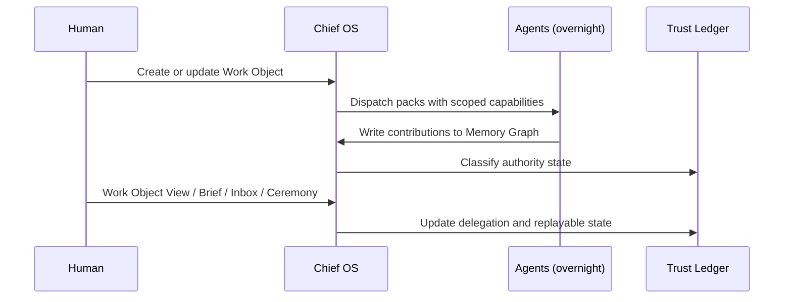

# North Star

## TL;DR

- AI-native OS; agents are first-class workers, humans steer and approve.
- Wedge: one **Work Object** that follows the user all day, addressable through protocol first and visible through surfaces second.
- Initial design persona: high-agency operator-builders doing cross-app work.
- Goal: let users delegate cross-app work without becoming managers of agent tools or agent servers.

## Product definition note

Current working definition:

> Chief OS is an agent-native operating substrate. Apps and agents run on top of a shared kernel that owns work state, capabilities, provenance, authority, and human approval.

"iOS for agents" remains useful shorthand for the platform ambition: a common contract beneath many apps. For the v0 build order, the more precise shape is headless-first: `chiefd`, `chief`/future `chiefctl`, HTTP/local-socket APIs, packs, and optional L4 surfaces. The visual OS matters because humans need oversight and approval, but UI should never become the source of truth.

This definition is expected to keep refining. Changes should preserve the axioms: no ambient authority, channel parity, dogfood parity, and demos that improve the Work Object / Stack flywheel.

## The loop

## What users uniquely get

Chief OS should be judged by enabled work, not by proof artifacts alone.

| User capability | What it feels like | Why Chief OS is different |
|---|---|---|
| Delegate one outcome across many tools | "Prepare the Acme follow-up" becomes obligations, slots, risk checks, and a draft without app-hopping | Packs compose through one OS-owned Work Object instead of point integrations |
| Keep working while agents keep updating the object | The same object stays live through the day: sources, drafts, risk, approvals, rewind | Surfaces are projections over L2 state; the Work Object is not trapped in a chat or app |
| Add a new capability midstream | Install `risk-pack`; it contributes to existing work without changing document/calendar/email packs | New packs integrate with the OS substrate, not with every other pack |
| Let low-stakes work proceed while high-stakes work stops | Drafting happens automatically; sending waits for Ceremony | Authority is OS-owned and consistent across packs |
| Ask "what changed?" and undo it | Rewind a draft contribution while preserving the history and marking downstream work stale | Rollback is a platform primitive, not a per-app undo button |

The product promise:

> Chief OS turns scattered agent actions into one inspectable, steerable, reversible unit of work.

## Initial design persona

**High-agency operator-builder.**

| Attribute | Signal |
|---|---|
| Work shape | Cross-app coordination across email, calendar, docs, files, and project systems |
| Tool count | Many open tabs, dashboards, agents, scripts, and personal workflows |
| Identity | "I want to delegate outcomes, not manage tools" |
| Technical comfort | Comfortable with CLI/API inspection when trust or debugging requires it |
| Trust need | Wants agents to act, but only with visible authority, receipts, and rollback |
| Failure mode today | Context, permissions, memory, approvals, and logs are scattered across tools |

**Not the initial design center:** generic chat users, coding-agent-only workflows, creator-tool workflows, and large enterprise governance. Those can become later deployment contexts, but they are not the clearest first lens.

## Why now

| Forcing function | Evidence |
|---|---|
| Tool-use reliability crossed shipping floor | 2025 harness benchmarks > 90% on bounded tasks |
| Long-running agent operation is feasible | Fast cloud tiers plus local Qwen/Llama-class models make always-on bounded tasks practical |
| Category demand proven, no trust floor yet | Rabbit / Humane failed precisely on trust + OS-absence |

## Staged vision

| Stage | Timeline | Scope | Primary metric |
|---|---|---|---|
| v0 — Headless Work Loop | 90 days | Single-human, deterministic Chief-of-Staff Stack, Work Object loop through HTTP/CLI/UI | Work Object loop completes end-to-end without UI-only state |
| v1 — Trust Graduates | +6 mo | Public pack API, auto-ship low-stakes, multi-device, renegotiation ritual | Repeated approved actions with low rewind rate |
| v2 — Consequential Work | +12 mo | Stronger Ceremony flows, higher-stakes document and commitment workflows, federation (Chief-to-Chief) | Consequential actions remain inspectable and reversible where possible |
| v3 — Full OS Experience | +24 mo | Reference hardware or full visual shell, enterprise-ready trust ledger | Daily work happens primarily through Chief-managed Work Objects |

## Success criteria

| Stage | Primary | Secondary | Kill signal |
|---|---|---|---|
| v0 | Work Object loop runs through real daemon + HTTP + CLI + reference surface | Human can approve, inspect, and rewind from the same substrate state | Demo depends on UI-local state or scripted data mutation |
| v1 | Packs can be built and installed without private APIs | Third-party pack can contribute to an existing Work Object | Pack coordination requires pairwise integration |
| v2 | Higher-stakes work produces clear authority, evidence, and rollback boundaries | Chief-to-Chief federation preserves receipts | Authority becomes ambiguous or app-local |
| v3 | Visual OS improves human control without weakening protocol parity | Surfaces remain projections over L2 state | UI becomes the product source of truth |

## Explicit non-goals

- Chat-as-primary surface → ChatGPT owns this.
- Coding agent → Cursor owns this.
- Browser → Arc owns this.
- Creator tools → Notion/Granola/Descript own this.
- Branded hardware at v0.
- Enterprise at v0.
- Mobile OS fork — phone is a surface, not a platform.
- On-device training (consumption only at v0).

## Competitive line

| Incumbent | Their territory | Our territory |
|---|---|---|
| ChatGPT / Claude Desktop | Chat | **The night (16 hrs you're not at desk)** |
| Lindy / Zapier Agents | SaaS automation | OS-level data gravity + trust floor |
| Cursor | Coding | Everything non-coding |
| Arc | Browser | Desktop / post-browser |
| Superhuman | Inbox only | Inbox + cal + files + approvals, unified |
| OpenAI Operator | Browser-bot | Local trust floor + provenance + rollback |
| Rabbit / Humane | Hardware gimmicks | Software substrate they lacked |

## North-star metric

**Approved actions per user per week, conditional on Trust-Ledger average ≥ 3/5 across the Chief-of-Staff Stack.**

Captures delegation volume, trust depth, and retention in one number.

## Related

- [`v0-scope`](./50-v0-scope-90-day.md) — concrete MVP
- [`viral-loop`](./60-viral-loop.md) — Morning Reveal + Stack flywheel
- [`hax-principles`](./01-hax-principles.md) — how HAX shapes the loop
