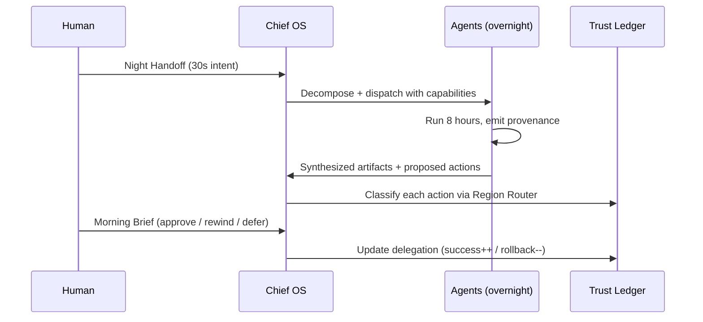

# North Star

## TL;DR

- AI-native OS; agents are first-class, humans are approvers.
- Wedge: **Night Handoff → Morning Brief** daily ritual.
- P0: high-agency prosumer-founders (3–5M globally).
- Goal: B2C virality via the Morning Reveal demo + forkable Stacks.

## The loop

## Person Zero

**High-agency prosumer-founder.**

| Attribute | Signal |
|---|---|
| Already pays | $200–500/mo across AI + productivity SaaS |
| Tool count | 12+ open tabs, 8 idle dashboards |
| Identity | "Not a manager of my tools" |
| Reads | Every.to, Tiago Forte / David Perell, PG essays |
| Early-adopter index | Rabbit, Humane, Perplexity, Arc, Granola buyer |
| Willingness-to-pay | $49 entry / $149 pro |
| Market size | 3–5M globally |
| LTV horizon | 36+ mo once ledger matures (90d+) |

**Not-P0:** enterprise (v3+), creators (Arc/Notion crowding), mainstream non-technical (trust vocab gap), every-knowledge-worker (too generic).

## Why now

| Forcing function | Evidence |
|---|---|
| Tool-use reliability crossed shipping floor | 2025 harness benchmarks > 90% on bounded tasks |
| 24/7 agent economics feasible | Haiku-tier + local Qwen enable $15–40/mo COGS at scale |
| Category demand proven, no trust floor yet | Rabbit / Humane failed precisely on trust + OS-absence |

## Staged vision

| Stage | Timeline | Scope | Primary metric |
|---|---|---|---|
| v0 — Night Loop | 90 days | Single-human, hardcoded Chief-of-Staff Stack, no money/legal | Hero video views × waitlist signups |
| v1 — Trust Graduates | +6 mo | Public pack API, auto-ship low-stakes, multi-device, renegotiation ritual | Day-30 retention |
| v2 — Money & Legal | +12 mo | Ceremony UI, e-sign, wire rails, federation (Chief-to-Chief) | Autonomous-ship rate |
| v3 — Branded Device | +24 mo | Reference hardware, enterprise-ready trust ledger | Device sell-through + enterprise pilots |

## Success criteria

| Stage | Primary | Secondary | Kill signal |
|---|---|---|---|
| v0 | Hero views × waitlist | Day-7 retention | Install completion < 15% |
| v1 | Day-30 retention | # third-party packs | Ledger growth stalls for > 60% users |
| v2 | Autonomous-ship rate | Federation pairs | Regulatory rollback of posture |
| v3 | Device sell-through | Enterprise pilots | Device flop + weak enterprise demand |

## Explicit non-goals

- Chat-as-primary surface → ChatGPT owns this.
- Coding agent → Cursor owns this.
- Browser → Arc owns this.
- Creator tools → Notion/Granola/Descript own this.
- Branded hardware at v0.
- Enterprise at v0.
- Mobile OS fork — phone is a surface, not a platform.
- On-device training (consumption only at v0).

## Competitive line

| Incumbent | Their territory | Our territory |
|---|---|---|
| ChatGPT / Claude Desktop | Chat | **The night (16 hrs you're not at desk)** |
| Lindy / Zapier Agents | SaaS automation | OS-level data gravity + trust floor |
| Cursor | Coding | Everything non-coding |
| Arc | Browser | Desktop / post-browser |
| Superhuman | Inbox only | Inbox + cal + files + approvals, unified |
| OpenAI Operator | Browser-bot | Local trust floor + provenance + rollback |
| Rabbit / Humane | Hardware gimmicks | Software substrate they lacked |

## North-star metric

**Approved actions per user per week, conditional on Trust-Ledger average ≥ 3/5 across the Chief-of-Staff Stack.**

Captures delegation volume, trust depth, and retention in one number.

## Related

- [`v0-scope`](./13-v0-scope-90-day.md) — concrete MVP
- [`viral-loop`](./10-viral-loop.md) — Morning Reveal + Stack flywheel
- [`hax-principles`](./01-hax-principles.md) — how HAX shapes the loop
