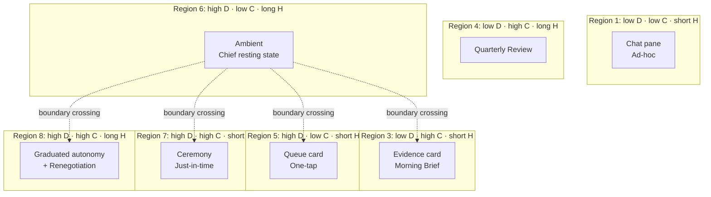

# HAX Principles Applied

## TL;DR

- HAX = Human-Agent eXperience theory. 3 dims: delegation depth, consequentiality, commitment horizon.
- Chief OS encodes HAX as **kernel primitives**, not a UX skin.
- Region Router is deterministic code; routes every action to its appropriate friction tier.
- Trust Ledger grows/shrinks via evidence, not prompts.

## The three dimensions → OS primitives

| HAX dimension | OS primitive | Location |
|---|---|---|
| Delegation depth | Trust Ledger (per-category 1–5) | L2 kernel service |
| Consequentiality | Action metadata + Region Router | L2 kernel service |
| Commitment horizon | Memory node `horizon` tag | L2 Memory Graph |

## Trust Ledger — write rules

| Event | Ledger change |
|---|---|
| N successful approvals in category X | `ledger[X] += 1` (cap 5) |
| M rollbacks or vetoes in X | `ledger[X] -= 1` (floor 1) |
| Quarterly Review explicit reset | User-set |
| Never | LLM output rewriting ledger |

Defaults: N=20 for most categories, M=1 (single rollback → –1).

## Action metadata schema

```yaml
action:
  id: <content-hash>
  proposed_by: <agent-id>
  tool: <tool-id>
  reversibility_class: hard | soft | irreversible
  monetary_impact_usd: 0
  affected_parties: [party-ids]
  legal_effect: none | draft | binding
  time_to_detect_on_failure: seconds | minutes | hours | days
  horizon: short | medium | long | open
  category: <trust-ledger-key>
  evidence_refs: [mem://...]
```

## HAX 8-region map



## Region Router — contract

**Inputs:** action metadata + Trust Ledger snapshot + memory horizon.
**Output:** `{region: 1–8, surface: queue-card | evidence-card | ceremony, friction_tier: 0–4, audit_template: <id>}`.
**Determinism:** rule-table, no LLM. Rules live in `adr/` when changed.

## Friction tiers

| Tier | Surface pattern | Example |
|---|---|---|
| 0 | Auto-send, logged | Auto-reply "got it, thanks" under policy |
| 1 | Single tap | Draft reply ship |
| 2 | Evidence card + confirm | Schedule meeting with new contact |
| 3 | Ceremony (3s hold + biometric + 60s cooldown) | Wire $2,400 |
| 4 | Ceremony + co-sign | Contract > $10k, commit > 6 mo |

## Renegotiation ritual (Region 8)

Every 90 days, Chief OS triggers Quarterly Review:

1. Summarize delegation: what's been approved, vetoed, ambient longest.
2. User lifts, lowers, or restructures categories.
3. Chief writes flake diff to house-rules config.
4. Provenance anchor: *"Renegotiated 2026-07-21"*.

## Verification-efficiency rules

- No "Are you sure?" popups.
- Every ceremony shows decision + sources + confidence + what-was-rejected.
- Rollback affordance on every action, with honest window (*"reversible until 10am"*).

## Acceptance

- [ ] Trust Ledger is a kernel service with a stable API; no LLM writes it.
- [ ] Region Router is deterministic, rule-table-driven, covered by unit tests.
- [ ] Every Surface is a declarative view over Ledger + Router outputs.
- [ ] Quarterly Review ritual scheduler exists in v0.

## Open questions

1. Default N (approvals→upgrade) value per category?
2. Does delegation DECAY if a category is unused for 30 days?
3. Cross-category coupling: should finance require calendar ≥ 3/5 (presence-of-life signal)?

## Related

- [`chief-kernel`](./03-chief-kernel.md) — Trust Ledger & Region Router impl surfaces
- [`surfaces`](./05-surfaces.md) — how friction tiers render
- [`security-model`](./06-security-model.md) — cryptographic coupling
