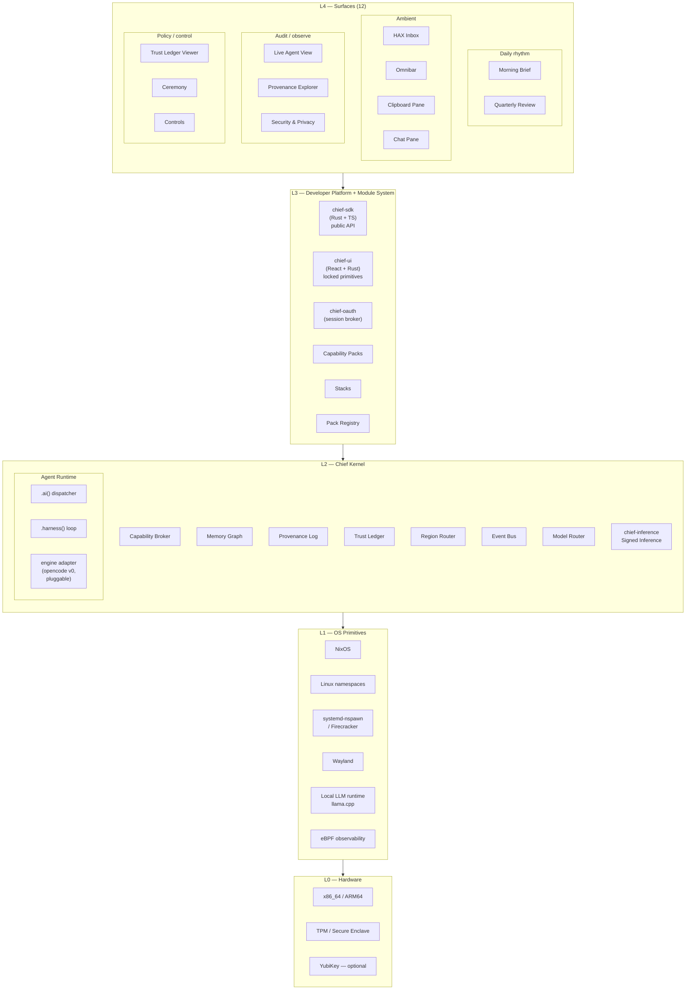
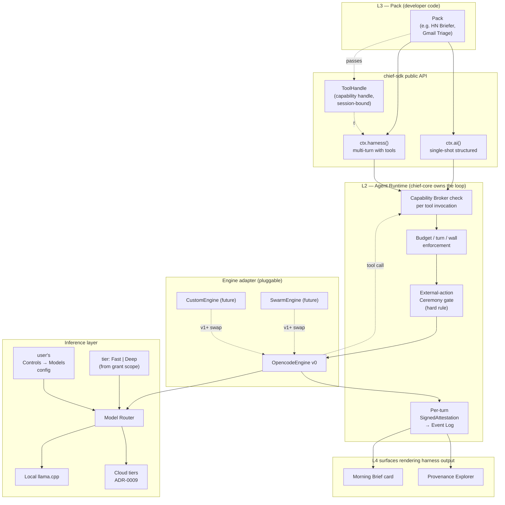
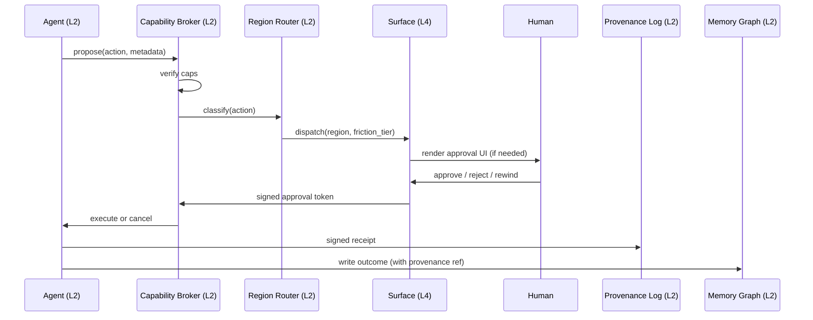

# Architecture

## TL;DR

- 5 layers. L0 commodity, L1 boring (Nix + Linux), L2 novel (kernel services), L3 extension (developer platform + packs), L4 product (12 surfaces).
- We own L2–L4. We vendor L0–L1.
- The OS is a protocol (HTTP + CLI + socket + surface). Channel parity is non-negotiable.
- **Substrate spine** (from research): signed typed event log, CAS filesystem, `kbd://` clipboard, HAX inbox, omnibar. Everything else is a view.
- **Signed Inference** ([ADR-0009](../adr/0009-signed-inference.md)): every model call mediated by `chief-inference` and accompanied by a ~400 B cryptographic attestation. Category-defining for regulatory posture + anti-impersonation.
- **Developer platform at L3** ([ADR-0010](../adr/0010-sdk-public-api-stability.md), [ADR-0011](../adr/0011-ui-stack-and-component-library.md)): `chief-sdk` is the stable public API all packs use; `chief-ui` is the locked component kit (React primitives + Rust mirror) that every surface composes. First-party packs use the same public surface as third-party packs (dogfood parity).
- **Agent Runtime is a L2 kernel service** ([ADR-0013](../adr/0013-agent-runtime-two-tier-llm.md)): two primitives `ctx.ai()` + `ctx.harness()`. chief-core owns the loop; engine adapter (opencode at v0) is pluggable. Pack declares `tier`; model router picks from user's Controls → Models config.
- **Control decomposition at L4** ([ADR-0012](../adr/0012-no-settings-app.md)): no Settings app. Security & Privacy is the unified read-dominant access view; Controls is the tight cosmetic-preferences surface; Trust Ledger is delegation-by-category; Ceremony is the only write path for authority-increase.

## Layer map



Diagram also at [`diagrams/layers.mmd`](./diagrams/layers.mmd).

### Surface inventory (L4, grouped by function)

| Group | Surfaces | HAX region(s) | Notes |
|---|---|---|---|
| Daily rhythm | Morning Brief, Quarterly Review | 3, 4, 5, 6, 8 | Time-bound rituals |
| Ambient | HAX Inbox, Omnibar, Clipboard Pane, Chat Pane | 1, 3, 5, 7, 8 | Always-summonable |
| Audit / observe | Live Agent View, Provenance Explorer, **Security & Privacy** | 3, 4, 6 | Read-dominant |
| Policy / control | Trust Ledger Viewer, Ceremony, **Controls** | 1, 2, 4, 7, 8 | Writes gated by consequentiality |

Security & Privacy and Controls are new per [ADR-0012](../adr/0012-no-settings-app.md). See [`05-surfaces.md`](./05-surfaces.md) and [`19-controls-and-policy.md`](./19-controls-and-policy.md).

## Per-layer intent

| Layer | Owned by | Purpose | Examples of in-scope | Examples of out-of-scope |
|---|---|---|---|---|
| L4 Surfaces | Chief OS | Projections of L2 state for humans; composed from `chief-ui` primitives | 12 named surfaces (Brief, Ceremony, Security & Privacy, …) | Games, creative tools |
| L3 Developer Platform + Module System | Chief OS + community | Stable public API (`chief-sdk`), locked component kit (`chief-ui`), OAuth broker (`chief-oauth`), pack format + registry + Stacks | The above + pack manifest format + install toolchain | Third-party kernels, ad-hoc UI libraries |
| L2 Chief Kernel | Chief OS | Novel primitives: **Agent Runtime** (two-tier LLM + loop), capabilities, memory, provenance, trust, regions, model routing, signed inference | Capability Broker, Region Router, Model Router, `ctx.harness()` loop, engine adapter | Replacing Linux syscalls |
| L1 OS Primitives | Vendor (NixOS, Linux) | Boring infrastructure we reuse | Immutable root, Wayland, microVMs, llama.cpp | Rewriting the kernel |
| L0 Hardware | Vendor | Commodity compute + hardware trust root | TPM-sealed keys | Custom silicon (v5+) |

## Developer platform (L3) — new

The developer platform layer is what packs (first-party and third-party) consume. It sits between L2 kernel services and L4 surfaces, providing a stable public contract that survives kernel-internal churn.

| Component | Shipped | Role |
|---|---|---|
| **`chief-sdk`** (Rust + TypeScript) | PR #31 (v0.1) → v0.2 in flight | Public API all packs use. Closed `CapabilityKind` enum, typed `Grant`, `Pack`/`Agent`/`Tool`/`Ingester` traits, `CapabilityContext` with `ctx.ai()` / `ctx.harness()` / `ctx.net_tool()` etc. Semver-bound per [ADR-0010](../adr/0010-sdk-public-api-stability.md). |
| **`chief-ui`** (React + Rust) | PR #34 | Locked 17-primitive component kit. `<Pane>`, `<Row>`, `<Badge>` (closed HAX variants), `<CommandPill>`, `<HoldRing>`, `<CeremonyCard>`, etc. Radix under the hood; Shadcn source vendored; re-themed with Chief tokens. Enforced per [ADR-0011](../adr/0011-ui-stack-and-component-library.md). |
| **`chief-oauth`** | PR #33 | OAuth session broker; bearer tokens sealed at rest, packs only ever see opaque `SessionHandle`. |
| **Capability Packs + Stacks + Pack Registry** | design stable; impl v0 in flight | The modular extension system itself — pack format, Nix-flake packaging, signed manifests, install toolchain. |

**Dogfood parity is an enforced invariant**: first-party packs (HN Briefer, Gmail Triage, Calendar Negotiator, …) consume the exact same public `chief-sdk` + `chief-ui` surface as any third-party pack. No backdoors. If first-party needs something, it gets added to the public API and everyone benefits.

## Agent Runtime (L2) — new

Per [ADR-0013](../adr/0013-agent-runtime-two-tier-llm.md). The Agent Runtime is a L2 kernel service that exposes two primitives to packs and owns the multi-turn loop for `.harness()`.



Diagram also at [`diagrams/agent-runtime.mmd`](./diagrams/agent-runtime.mmd). Full spec: [`20-agent-runtime.md`](./20-agent-runtime.md).

Key invariants enforced by the runtime:

| Invariant | Mechanism |
|---|---|
| Every tool call goes through the Capability Broker | chief-core intercepts each engine-emitted tool_call before dispatch |
| Every turn produces a signed attestation | Attestation chain → Event Log → verifiable in Provenance Explorer |
| Budget (max_turns / max_cost_usd / max_wall_secs) enforced | Per-session state in chief-core; session killed on overflow |
| External actions (R7–R8) never harness-autonomous | Gate intercepts `share.hand_off` / `payment.request` / `esign.request` → Ceremony |
| Packs cannot bring their own LLM loop | SDK exposes only `ctx.ai()` / `ctx.harness()`; raw model/engine APIs not re-exported |
| User controls model routing | Router reads Controls → Models config; packs hint but can't force |

## Language policy (polyglot)

Pick the right tool per layer. No mandatory single language.

| Layer / component | Language | Why |
|---|---|---|
| L2 kernel services (Broker, Provenance, Router, Trust Ledger, Model Router, Agent Runtime) | **Rust** | Memory safety + perf for hot paths; fuzz- and formal-verification-friendly |
| L2 network-heavy (Cloud-twin bridge, MCP transport shims, Event Bus) | **Go** | Mature networking, concurrent, good deployment story |
| L3 `chief-sdk` | **Rust + TypeScript** | Rust for typed pack authoring + workspace members; TS for browser-side pane authoring |
| L3 `chief-ui` | **TypeScript (React) + Rust prop-type mirror** | React for actual surface rendering via Tauri webview; Rust mirror for pack-manifest types |
| L3 `chief-oauth` | **Rust** | Sealed storage + cryptographic flow safety |
| L3 packs (third-party + first-party) | **Rust** at v0 | Closed-enum + trait contract; TS packs arrive post-v0 with identical semantic contract |
| L4 surfaces | **TypeScript** (Tauri v2 + React + `chief-ui`) | Composition of locked primitives |
| Agents / ingesters | **Rust** inside packs (no in-pack Python at v0) | Keep the pack sandbox minimal; Python packs arrive post-v0 |
| L1 glue (Nix modules, systemd units) | **Nix** + **Bash** | Where boring works |

We do NOT optimize OS boot time at v0 — explicit non-goal (see [`14-risks-open-questions.md`](./14-risks-open-questions.md)).

## Ownership summary

```
Build:  L4 surfaces (12), L3 developer platform (chief-sdk / chief-ui / chief-oauth) +
        pack system, L2 kernel services (incl. Agent Runtime + Model Router + opencode
        adapter), v0 first-party packs (HN Briefer shipped; Gmail / Calendar upcoming)
Vendor: L1 NixOS + Linux stack, L0 commodity hardware, opencode (engine at v0),
        llama.cpp (local inference), Radix (UI primitives), Shadcn source (vendored
        into chief-ui, re-themed)
Bridge: L1→L2 adapters (nspawn wrappers, eBPF collectors, Wayland compositor plugins),
        engine adapter contract (HarnessEngine trait)
```

## Substrate spine — the five L2 primitives

From research [`research/2026-04-21-ai-native-primitive-rethinks.md`](./research/2026-04-21-ai-native-primitive-rethinks.md). These five primitives form the substrate on which everything else is a view or policy:

| # | Primitive | Role | Grows from |
|---|---|---|---|
| 1 | **Signed Typed Event Log** | The substrate. Every action = typed signed tuple. | Provenance Log service |
| 2 | **Chief FS (CAS + FUSE shim)** | Pins matter to the substrate. blake3 CIDs, human-folder legacy view. | Memory Graph blobs + L1 FUSE |
| 3 | **`kbd://` Clipboard** | Funnels intent into the substrate. Typed, provenanced. | New L2 service (Clipboard Bus) |
| 4 | **HAX Inbox** | Output channel to human. Replaces all popup notifications. | Region Router + Ceremony surface |
| 5 | **Omnibar** | Read-side UI. Semantic search over Memory Graph. | Memory Graph + new Search service |

Ordering is strategic: #1 is foundational; #2 pins matter to it; #3 funnels ambient intent; #4 is how the human hears back; #5 is how the human reaches in.

See ADRs [`0005`](../adr/0005-signed-typed-event-log.md), [`0006`](../adr/0006-cas-filesystem.md), [`0007`](../adr/0007-hax-inbox-notifications.md).

## Channel parity (Axiom 8)

Every piece of L2 state exposes 4 channels:

| Channel | Consumer | Notes |
|---|---|---|
| HTTP API | Cloud twin, remote humans, external agents | Bearer-token auth, rate-limited |
| CLI (`chief`) | Power users, scripts, agents-as-users | Typed subcommands, JSON output `--json` |
| Unix socket | Local agents, local packs | Fast path, no serialization overhead |
| Surface | Humans | Declarative view over same state |

If a feature works on one channel but not others, it is not ready.

## Data flow — action lifecycle



Diagram also at [`diagrams/approval-flow.mmd`](./diagrams/approval-flow.mmd).

## Process model

| Process | Lifetime | Isolation (v0) | Isolation (v1+) |
|---|---|---|---|
| Chief Kernel services | Long (per boot) | systemd unit, user-namespace | microVM (Firecracker) |
| Agent (harness) | Task-scoped, minutes–hours | systemd-nspawn + namespace | microVM per agent |
| Pack init / bg worker | Pack-lifecycle | nspawn + cgroup limits | microVM per pack |
| Cloud twin | On-demand | Remote, TLS | Remote, TLS + attested |
| Surface renderer | Session | Wayland per-client | Wayland per-client |

## Boot sequence

```
BIOS → Nix bootloader → minimal initramfs → Chief Kernel systemd target →
  Agent Runtime + Capability Broker + Memory Graph + Provenance Log + Trust Ledger + Region Router
  → Morning Brief surface renderer
```

**Target:** power-on → Morning Brief visible in ≤10 seconds on modern hardware. No login screen, no desktop environment, no greeter.

## What an agent sees

An agent is a process with:

- A **principal** (tied to user identity via kernel-issued token).
- A **capability set** (typed, expiring, narrow).
- An **outbox** of proposed actions (submitted to Capability Broker).
- A **memory-read contract** (scoped URIs it may read).
- A **memory-write contract** (scoped URIs it may write, with provenance obligation).
- An **event-bus subscription** (filtered by capability).

Agents do not call syscalls directly for capability-relevant operations. They go through the Broker. This is the enforcement point for Axiom 2.

## Acceptance

- [ ] Layer boundaries defined with explicit APIs across all 4 channels.
- [ ] L0/L1 dependencies frozen as a Nix flake at v0 commit.
- [ ] L2 services independently testable (each has a dedicated contract doc in `requirements/`).
- [ ] L3 pack format stable enough to publish before v1.
- [ ] L4 surfaces are declarative projections; no business logic lives here.

## Open questions

1. Does the cloud twin get its own kernel-service process or reuse local broker via remote proxy?
2. Where does speech-to-text live (L1 primitive or L2 service)?
3. Should the event bus be a kernel service or a Nix service outside L2 for v0?
4. Do Stacks deserve their own layer, or are they just curated pack manifests in L3?

## Related

- [`chief-kernel`](./03-chief-kernel.md) — L2 detail
- [`security-model`](./06-security-model.md) — cap-broker enforcement
- [`base-and-hardware`](./07-base-and-hardware.md) — L0/L1 choices
- [`module-system`](./04-module-system.md) — L3 pack format
- [`pack-sdk`](./16-pack-sdk.md) — L3 `chief-sdk` public surface + CapabilityKind enum
- [`ui-standardization`](./18-ui-standardization.md) — L3 `chief-ui` primitive catalog
- [`surfaces`](./05-surfaces.md) — L4 detail
- [`controls-and-policy`](./19-controls-and-policy.md) — L4 Security & Privacy + Controls decomposition
- [`agent-runtime`](./20-agent-runtime.md) — L2 Agent Runtime spec (two-tier LLM)
- [`local-vs-cloud`](./09-local-vs-cloud.md) — Model Router swappability
- [`requirements/non-functional.md`](./requirements/non-functional.md) — language + performance constraints
- ADRs: [`0010`](../adr/0010-sdk-public-api-stability.md), [`0011`](../adr/0011-ui-stack-and-component-library.md), [`0012`](../adr/0012-no-settings-app.md), [`0013`](../adr/0013-agent-runtime-two-tier-llm.md)
