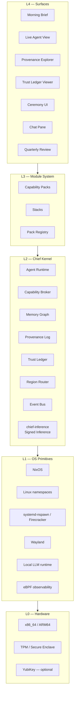
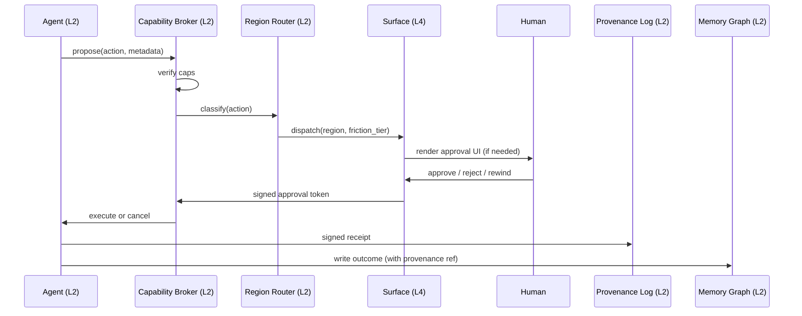

# Architecture

## TL;DR

- 5 layers. L0 commodity, L1 boring (Nix + Linux), L2 novel (kernel services), L3 extension (Capability Packs), L4 product (surfaces).
- We own L2–L4. We vendor L0–L1.
- The OS is a protocol (HTTP + CLI + socket + surface). Channel parity is non-negotiable.
- **Substrate spine** (from research): signed typed event log, CAS filesystem, `kbd://` clipboard, HAX inbox, omnibar. Everything else is a view.
- **Signed Inference** ([ADR-0009](../adr/0009-signed-inference.md)): every model call mediated by `chief-inference` and accompanied by a ~400 B cryptographic attestation. Category-defining for regulatory posture + anti-impersonation.

## Layer map



Diagram also at [`diagrams/layers.mmd`](./diagrams/layers.mmd).

## Per-layer intent

| Layer | Owned by | Purpose | Examples of in-scope | Examples of out-of-scope |
|---|---|---|---|---|
| L4 Surfaces | Chief OS | Projections of L2 state for humans | Morning Brief, Ceremony UI | Games, creative tools |
| L3 Module System | Chief OS + community | Extension via Capability Packs | Pack format, registry, Stacks | Third-party kernels |
| L2 Chief Kernel | Chief OS | Novel primitives: agents, capabilities, memory, provenance, trust, regions, model routing | Capability Broker, Region Router, Model Router | Replacing Linux syscalls |
| L1 OS Primitives | Vendor (NixOS, Linux) | Boring infrastructure we reuse | Immutable root, Wayland, microVMs | Rewriting the kernel |
| L0 Hardware | Vendor | Commodity compute + hardware trust root | TPM-sealed keys | Custom silicon (v5+) |

## Language policy (polyglot)

Pick the right tool per layer. No mandatory single language.

| Layer / component | Language | Why |
|---|---|---|
| L2 kernel services (Broker, Provenance, Router, Trust Ledger, Model Router) | **Rust** | Memory safety + perf for hot paths; fuzz- and formal-verification-friendly |
| L2 network-heavy (Cloud-twin bridge, MCP transport shims, Event Bus) | **Go** | Mature networking, concurrent, good deployment story |
| L3 SDK + pack authoring | **TypeScript** + **Python** | Reach the most pack authors; TS for panes/tools, Python for agents/ingesters |
| L4 surfaces | **TypeScript** (Tauri/Wry + React or Svelte) | Pane authoring shares tooling with pack authors |
| Agents / ingesters | **Python** or **TypeScript** | ML + orchestration ecosystem |
| L1 glue (Nix modules, systemd units) | **Nix** + **Bash** | Where boring works |

We do NOT optimize OS boot time at v0 — explicit non-goal (see [`14-risks-open-questions.md`](./14-risks-open-questions.md)).

## Ownership summary

```
Build:  L4 surfaces, L3 pack system, L2 kernel services, v0 first-party packs
Vendor: L1 NixOS + Linux stack, L0 commodity hardware
Bridge: L1→L2 adapters (nspawn wrappers, eBPF collectors, Wayland compositor plugins)
```

## Substrate spine — the five L2 primitives

From research [`research/2026-04-21-ai-native-primitive-rethinks.md`](./research/2026-04-21-ai-native-primitive-rethinks.md). These five primitives form the substrate on which everything else is a view or policy:

| # | Primitive | Role | Grows from |
|---|---|---|---|
| 1 | **Signed Typed Event Log** | The substrate. Every action = typed signed tuple. | Provenance Log service |
| 2 | **Chief FS (CAS + FUSE shim)** | Pins matter to the substrate. blake3 CIDs, human-folder legacy view. | Memory Graph blobs + L1 FUSE |
| 3 | **`kbd://` Clipboard** | Funnels intent into the substrate. Typed, provenanced. | New L2 service (Clipboard Bus) |
| 4 | **HAX Inbox** | Output channel to human. Replaces all popup notifications. | Region Router + Ceremony surface |
| 5 | **Omnibar** | Read-side UI. Semantic search over Memory Graph. | Memory Graph + new Search service |

Ordering is strategic: #1 is foundational; #2 pins matter to it; #3 funnels ambient intent; #4 is how the human hears back; #5 is how the human reaches in.

See ADRs [`0005`](../adr/0005-signed-typed-event-log.md), [`0006`](../adr/0006-cas-filesystem.md), [`0007`](../adr/0007-hax-inbox-notifications.md).

## Channel parity (Axiom 8)

Every piece of L2 state exposes 4 channels:

| Channel | Consumer | Notes |
|---|---|---|
| HTTP API | Cloud twin, remote humans, external agents | Bearer-token auth, rate-limited |
| CLI (`chief`) | Power users, scripts, agents-as-users | Typed subcommands, JSON output `--json` |
| Unix socket | Local agents, local packs | Fast path, no serialization overhead |
| Surface | Humans | Declarative view over same state |

If a feature works on one channel but not others, it is not ready.

## Data flow — action lifecycle



Diagram also at [`diagrams/approval-flow.mmd`](./diagrams/approval-flow.mmd).

## Process model

| Process | Lifetime | Isolation (v0) | Isolation (v1+) |
|---|---|---|---|
| Chief Kernel services | Long (per boot) | systemd unit, user-namespace | microVM (Firecracker) |
| Agent (harness) | Task-scoped, minutes–hours | systemd-nspawn + namespace | microVM per agent |
| Pack init / bg worker | Pack-lifecycle | nspawn + cgroup limits | microVM per pack |
| Cloud twin | On-demand | Remote, TLS | Remote, TLS + attested |
| Surface renderer | Session | Wayland per-client | Wayland per-client |

## Boot sequence

```
BIOS → Nix bootloader → minimal initramfs → Chief Kernel systemd target →
  Agent Runtime + Capability Broker + Memory Graph + Provenance Log + Trust Ledger + Region Router
  → Morning Brief surface renderer
```

**Target:** power-on → Morning Brief visible in ≤10 seconds on modern hardware. No login screen, no desktop environment, no greeter.

## What an agent sees

An agent is a process with:

- A **principal** (tied to user identity via kernel-issued token).
- A **capability set** (typed, expiring, narrow).
- An **outbox** of proposed actions (submitted to Capability Broker).
- A **memory-read contract** (scoped URIs it may read).
- A **memory-write contract** (scoped URIs it may write, with provenance obligation).
- An **event-bus subscription** (filtered by capability).

Agents do not call syscalls directly for capability-relevant operations. They go through the Broker. This is the enforcement point for Axiom 2.

## Acceptance

- [ ] Layer boundaries defined with explicit APIs across all 4 channels.
- [ ] L0/L1 dependencies frozen as a Nix flake at v0 commit.
- [ ] L2 services independently testable (each has a dedicated contract doc in `requirements/`).
- [ ] L3 pack format stable enough to publish before v1.
- [ ] L4 surfaces are declarative projections; no business logic lives here.

## Open questions

1. Does the cloud twin get its own kernel-service process or reuse local broker via remote proxy?
2. Where does speech-to-text live (L1 primitive or L2 service)?
3. Should the event bus be a kernel service or a Nix service outside L2 for v0?
4. Do Stacks deserve their own layer, or are they just curated pack manifests in L3?

## Related

- [`chief-kernel`](./03-chief-kernel.md) — L2 detail
- [`security-model`](./06-security-model.md) — cap-broker enforcement
- [`base-and-hardware`](./07-base-and-hardware.md) — L0/L1 choices
- [`module-system`](./04-module-system.md) — L3 format
- [`surfaces`](./05-surfaces.md) — L4 detail
- [`local-vs-cloud`](./09-local-vs-cloud.md) — Model Router swappability
- [`requirements/non-functional.md`](./requirements/non-functional.md) — language + performance constraints
