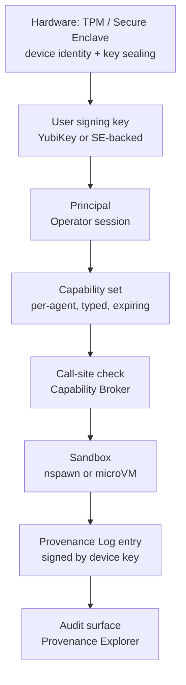
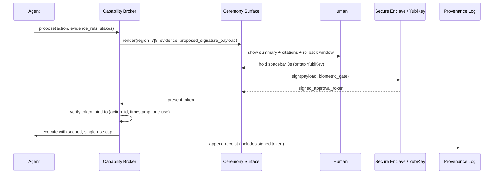

# Security Model

## TL;DR

- Capability-based from hardware up. No ambient authority (Axiom 2).
- Trust chain: TPM → user key → principal → capability set → call-site → sandbox → provenance.
- Approval ceremony = cryptographic boundary between "Chief drafts" and "human acts."
- Pack supply chain: required signing + capability display + community trust + official-tier insurance.

## Trust chain



Diagram also at [`diagrams/approval-flow.mmd`](./diagrams/approval-flow.mmd) (extended form with human).

## Threat model

| Actor | Capability | Goal | Our defense |
|---|---|---|---|
| Malicious pack author | Can publish pack with grant requests | Exfiltrate data, send on your behalf | Required signing, capability display before install, sandboxed exec, trust score, official-tier insurance |
| Compromised cloud twin | Network access to user device | Read memory graph, forge actions | Cloud twin is stateless; receives encrypted blobs; signatures verified on device |
| Stolen / lost device | Physical access | Impersonate user, drain accounts | TPM-sealed keys; LUKS on all state; post-unlock session timeout; human biometric for ceremonies |
| Supply-chain attack on Nix deps | Poisoned Nix substitute | Inject code into Chief Kernel | Reproducible builds + binary cache pinning + nix-store signature verification |
| Prompt injection via ingested content | Attacker's email or file contains attack text | Trick agent into running malicious tool | Capability-sandboxed agents (attack limited to grants); Region Router flags anomalous action metadata; no agent can escalate its own grants |
| Rogue LLM | Model subtly drifts / hallucinates | Draft harmful action | Every ship gated by human approval; Region Router raises friction on high-stakes; rollback primitive covers mistakes |
| Physical observer / shoulder surf | Sees screen during approval | Coerce / abuse ceremony | Ceremony shows only redacted summary by default; sensitive detail requires explicit "reveal" gesture |
| Rogue sysadmin / IT (enterprise v3+) | OS-level privilege | Exfiltrate user state | User key never leaves SE; provenance chain detects tampering |

## Capability format

Every grant is typed, scoped, expiring, revocable, and auditable.

```yaml
grant:
  id: g-<hash>
  principal: pack:<name>/agent:<name>/rev:<git-hash>
  capability: <capability-kind>         # gmail.send, calendar.create, fs.read, net.http, tool.stripe.charge, ...
  scope:                                 # capability-specific narrowing
    # examples by kind
    gmail.send:
      threads_include: ["label:travel"]
      recipients_allowlist: ["user@acme.com"]
      max_body_chars: 1200
      requires_draft_review: true
    fs.read:
      paths: ["~/Downloads/**/*.pdf"]
    net.http:
      hosts_allowlist: ["api.skyscanner.com", "api.stripe.com"]
      methods: ["GET", "POST"]
    tool.stripe.charge:
      max_amount_usd: 100
      currency_allowlist: ["USD"]
  expires_at: 2026-05-21T00:00:00Z
  issued_by: user-approval:ceremony-<id>
  revocable: true
  delegatable: false                     # grants cannot be sub-delegated
```

## Approval ceremony

Region 7 and 8 actions go through a ceremony. Cryptographic shape:



Tokens are:

- **Single-use.** Bound to `(action_id, timestamp)`.
- **Short-lived.** Expire in minutes, not hours.
- **Non-replayable.** Broker journals consumed tokens.
- **Linkable.** Provenance Log entry forever references the token hash.

## Sandboxing (defense in depth)

| Layer | v0 | v1+ |
|---|---|---|
| Process isolation | `systemd-nspawn` + user namespace | `Firecracker` microVM per agent |
| Filesystem | OverlayFS, per-pack root | MicroVM + virtio-fs |
| Network | Per-pack `netns` + nftables allowlist | MicroVM + vsock to broker only |
| System call filter | `seccomp-bpf` with narrow allowlist | Same, plus microVM boundary |
| GPU / accelerator | Shared, mediated via API proxy | Per-microVM passthrough (if hw supports) |
| Audio / video | Explicit grant per call | Same |
| Secret material | Memory-mapped from SE, never disk | Same + attested memory |

## Pack supply chain

| Tier | Signature | Review | Cap defaults | Insurance |
|---|---|---|---|---|
| **Official** | Chief OS key | Internal review + legal | Minimal-needed, narrowed | Backed by Chief for v1+ |
| **Verified community** | Author key + community attestation (≥ N reviewers) | Peer review | Declared | None |
| **Community** | Author key | None | Declared | None |
| **Local / private** | User-generated | N/A | Declared | N/A |

**Install always shows:** cap-list, pack signer identity, pack version, pack trust score, pack last-updated. User taps explicit consent per capability kind.

## User key management

- Primary key: TPM or Secure Enclave sealed. Never leaves hardware.
- Recovery: split M-of-N across trusted contacts (Shamir); recovery requires in-person attestation in v1.
- Rotation: explicit ritual; old key signs new key; provenance records the rotation.
- YubiKey: optional secondary signing device; ceremonies can require either SE or YubiKey.

## Audit surface

The Provenance Explorer (L4 surface) lets any human — user or auditor — reconstruct:

- Every action an agent took.
- Every tool call, with args hash (args stored encrypted; revealed on consent).
- Every capability grant issued and revoked.
- Every approval ceremony, with signature chain.
- Every rollback, with before/after diff.

## What we explicitly do NOT do

- Rely on LLM to make security decisions.
- Have a "god mode" or administrator that bypasses capabilities.
- Allow packs to dynamically escalate grants at runtime.
- Ship a policy that can weaken Axiom 2.
- Keep approval-ceremony tokens valid beyond their single use.

## Acceptance

- [ ] Every L2 service refuses to act without a valid, scoped capability.
- [ ] eBPF enforces fs + net caps even if nspawn/namespace is misconfigured.
- [ ] Ceremony token replay returns `REPLAY_DETECTED` from broker.
- [ ] Pack install without signature is rejected; signature mismatch rejected.
- [ ] Provenance chain passes external Merkle verification.
- [ ] Rollback primitive tested end-to-end (files + memory + queued actions).

## Open questions

1. Do we ship a default on-device "firewall" (pf/nftables) even before packs declare caps, or deny-all?
2. Is v0 willing to ship without microVMs (nspawn only) given the stronger threat model the launch claim requires?
3. How do we bind ceremony biometric to the signing event in Secure Enclave — per-event auth vs. one-per-session?
4. What's the minimum viable Merkle-root-verification tool we ship for auditors?

## Related

- [`chief-kernel`](./03-chief-kernel.md) — Capability Broker internals
- [`module-system`](./04-module-system.md) — pack signing + grants display
- [`regulatory`](./15-regulatory-posture.md) — how this posture satisfies "machine as fax"
- [`adr/0002-capability-based-security.md`](../adr/0002-capability-based-security.md) — the canonical decision
