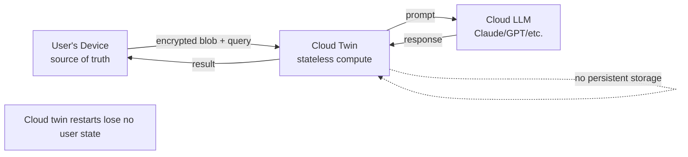

# Local vs Cloud — Hybrid Runtime

## TL;DR

- Source of truth lives on your device. Always.
- Cloud twin is a **stateless** compute surface for heavy reasoning. It never holds your data in the clear.
- Three work classes routed automatically: hot-path cloud, sensitive local, always-on state local (with encrypted replica).
- **`chief-inference` is a kernel service** (ADR-0009). Sole mediator of all model calls. Routes local / cloud at 5 granularities: system → category → pack → agent → call. **Emits a Signed Inference attestation per call.**
- Network-cable-pull is the trust demo: sensitive work never paused.
- **v0 targets CPU models + cloud only.** GPU scheduling deferred to v1+ per steward directive 2026-04-21.

## Three work classes

| Class | Where | Why |
|---|---|---|
| Hot-path reasoning | Cloud twin (Claude / GPT) | Quality matters for drafts, synthesis, research. Worth the $. |
| Sensitive reasoning | Local model (Qwen/Llama Q4 13–32B) | Finance, health, personal. Privacy non-negotiable. |
| Always-on state | Local authoritative + cloud encrypted replica | Source of truth lives with user. Cloud twin keeps encrypted mirror for cross-device read. |

## chief-inference — kernel service with Signed Inference

Model routing is a **first-class kernel service** (L2), not ad-hoc in each pack. Every inference call passes through `chief-inference`; the call-site sees a single `infer(prompt, params, caps) -> (output, attestation)` API. The router decides local vs cloud per-call based on a stack of policies resolved in this order:

```
CALL-LEVEL      explicit override set by caller  → wins if set
AGENT-LEVEL     agent's backend preference       → from pack manifest
PACK-LEVEL      pack's backend policy            → from pack manifest
CATEGORY-LEVEL  per trust-ledger-category policy → from user config
SYSTEM-LEVEL    global default                   → from house rules
```

### Default routing rules

```
if action.category in sensitive_categories:
    route → local_model                           # hard invariant
elif action.content_contains(sensitive_signals):
    route → local_model
elif complexity > local_model.ceiling:
    route → cloud_twin
else:
    route → local_model (cost savings)
```

`sensitive_categories` = {finance, health, personal, legal.private, family}. Expandable per user.
`sensitive_signals` = detector patterns: SSN, account numbers, medical terms, family names from contacts.

### Swappability (who chooses)

At v0 the system ships with opinionated defaults. The architecture already supports control at every level — the UX for who *chooses* is deferred:

| Granularity | Controlled by | v0 default | Future control UX (deferred) |
|---|---|---|---|
| System | House rules flake | "sensitive → local, else cloud" | Config surface for user |
| Category | Trust Ledger | Inherits system | Per-category toggle in Ledger viewer |
| Pack | Pack manifest | Pack declares preference; user consents | Pack's settings pane |
| Agent | Agent spec | Pack default | Rare; pack author opt-in |
| Call | Caller flag | Rare | Used for testing or forced-offline |

The architectural commitment: **`chief-inference` exists as a kernel service with a stable API**. Picking the UX for who controls what is a product decision, not an architecture blocker.

### Backend interface

```
trait ModelBackend {
    fn id() -> BackendId;                     // e.g. "local:qwen-2.5-32b-q4", "cloud:claude-sonnet-4-6"
    fn health() -> BackendHealth;
    fn capabilities() -> CapabilitySet;       // max context, vision, tool-use, etc.
    async fn infer(req: InferRequest) -> InferResponse;
    async fn embed(input: &[String]) -> Vec<Embedding>;
}
```

Concrete backends in v0: `LocalLlamaCpp` (CPU), `CloudClaude`, `CloudOpenAI`. Future: `LocalMlx` (Apple Silicon), `CloudGemini`, `CustomEndpoint`. GPU acceleration for local inference is v1+.

Adding a backend is a contained change: implement the trait, register at boot, policy layers automatically see it. Attestations are emitted by `chief-inference`, not by backends — backends don't need signing awareness.

### Signed Inference tiers

Per [ADR-0009](../adr/0009-signed-inference.md), every call produces an attestation labeled with its claim tier:

| Tier | Scenario | Claim strength |
|---|---|---|
| 1 — **Generated** | Local inference (llama.cpp + fastembed-rs + ort) signed by device key | Strong — "Chief generated this on device D at T" |
| 2 — **Co-signed** | Cloud inference with provider TEE (SEV-SNP / TDX) attestation | Strong — "Provider X attested, Chief co-signed" |
| 3 — **Custody** | Cloud inference without TEE | Chain-of-custody only — "Chief received from provider X at T" |

Attestation size ~400 B per call; signing overhead ~1–2 ms (≤ 5 ms NFR). Stored as `in-toto v1` statements in the Provenance Log; verifiable via `cosign`.

## Local model stack

| Layer | Choice | Notes |
|---|---|---|
| Inference engine | llama.cpp | Mature, quantized. **v0 runs CPU-only** (GPU deferred to v1+ per directive 2026-04-21). |
| Model (default) | Qwen 2.5 7B Q4 / Llama 3.2 8B Q4 for v0 CPU; 32B+ when GPU lands | Selected at install time based on available RAM. CPU-fit on 16 GB laptops. |
| Speech | whisper.cpp + Piper (v1) | Voice loop; v0 text-only |
| Embeddings | nomic-embed / bge-m3 | CPU-viable |
| Orchestration | opencode locally | Harness interface |

Install-time probe picks the largest model that fits in 50% of VRAM or 25% of RAM.

## Cloud twin — stateless contract



**Cloud twin invariants:**

- No persistent storage. Every request is stateless.
- All inputs are either (a) already non-sensitive per local policy, or (b) encrypted with device key before upload.
- Provenance obligations: every twin-computed artifact carries a signed receipt that gets folded into the local Provenance Log on return.
- Cloud LLM bills pay-as-you-go through our account; user never hands keys to third-party LLMs.

## Encrypted replica for retrieval

For non-sensitive horizons, users can opt into an encrypted cloud mirror to enable bigger-context queries when the local graph is slow or their device is offline:

- Device encrypts blobs + vectors with device key before upload.
- Cloud twin performs retrieval over ciphertext when supported (or over locally-decrypted-in-memory ephemeral copies when not).
- No provider can decrypt.

Disable by default for: finance, health, personal, family, legal.private.

## Network-cable-pull demo

The hero-video trust flex (see [`viral-loop`](./10-viral-loop.md)):

1. User yanks ethernet mid-demo.
2. Chief continues answering sensitive questions instantly.
3. Caption: *"Financial summary: on-device. Nothing left your machine."*

Implementation: Region Router classifies before dispatch. Sensitive classes never leave device. Cable state is monitored via eBPF; UI toggles an "offline" indicator but nothing functional changes for local paths.

## Resilience

| Failure | Effect |
|---|---|
| Cloud twin down | Local fallback degrades quality for non-sensitive, zero impact for sensitive |
| Cloud LLM rate-limited | Queue + local triage continues; Morning Brief may ship with "cloud work delayed" notice |
| Device network lost entirely | Sensitive work full-quality local; non-sensitive queued; everything resumes on reconnect |
| Device offline for days | Morning Brief still renders from last sync; cloud-only cards show "paused" |

## Compute economics

| Category | % of work (v0 target) | Cost model |
|---|---|---|
| Local inference | 50% (by ops count) | CPU/GPU energy; no per-call cost |
| Cloud LLM (Haiku-tier) | 40% | ~$0.25 / M input tokens |
| Cloud LLM (Sonnet/GPT-4-tier) | 10% | ~$3 / M input tokens |

**Target monthly cloud cost per P0 user:** $15–40 at $49 entry / $149 pro.

Tuning levers:
- Local-first routing (cheaper, private)
- Retrieval compression (fewer input tokens)
- Prompt caching (Claude prompt-cache for the stable parts of system prompts)
- Batch off-peak (overnight synthesis bills at flat / cache-hit rate)

## Upgrade path (v0 → v1+)

- v0: single local model, single cloud twin endpoint.
- v1: per-category model routing (legal pack → law-tuned model); per-user cloud pool.
- v2: federated twin — your Chief and a partner's Chief can share a work context transiently, both twins handle it.
- v3: on-device LoRA fine-tuning on your personal voice (consumption-only at v0).

## Acceptance

- [ ] Sensitive categories never trigger outbound HTTP to cloud LLM (verified via network trace in CI).
- [ ] Network-cable-pull: local path latency unaffected.
- [ ] Cloud twin loses all state on restart; no persistence-leak regression.
- [ ] Encrypted replica round-trip: device encrypt → cloud store → device decrypt → payload identical.
- [ ] Cost telemetry: per-user monthly cost visible in Trust Ledger viewer (optional).

## Open questions

1. Do we self-host cloud twins (one region each) or run on a managed provider? Privacy + latency + cost tradeoffs.
2. How do we let users bring their own cloud LLM keys (bypass our billing)? Policy + liability.
3. What's the storage budget for the encrypted cloud replica, and what's pruned first at the cap?
4. Do we ship an automatic "offline mode" banner or let users toggle explicitly?
5. If the device is lost, how does a replacement device rehydrate from the encrypted replica — what's the key-recovery UX?

## Related

- [`chief-kernel`](./03-chief-kernel.md) — runtime hosting
- [`memory-substrate`](./08-memory-substrate.md) — what replicates
- [`security-model`](./06-security-model.md) — cloud-twin trust model
- [`viral-loop`](./10-viral-loop.md) — network-cable-pull beat
