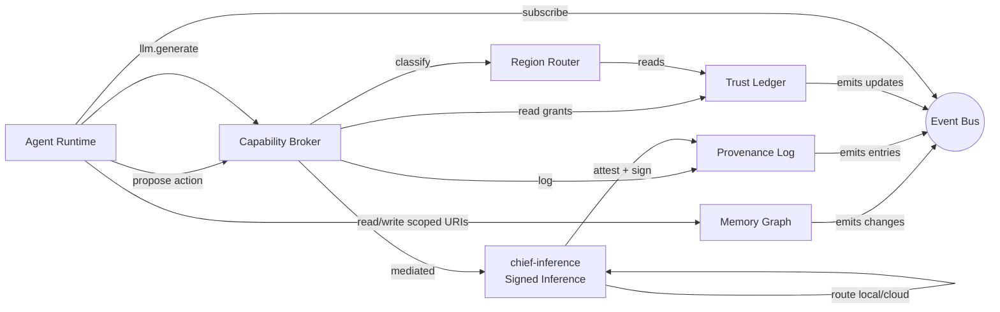

# Chief Kernel (L2)

## TL;DR

- 7 services. All expose HTTP + CLI + Unix socket + internal API.
- Product packaging target: headless `chiefd` owns these services; UI surfaces are clients, not required runtime dependencies.
- Agent Runtime hosts harnesses. **Harness interface is swappable** (opencode v0, AgentField / Claude Agent SDK / custom later).
- Capability Broker is the single enforcement point for Axiom 2.
- Region Router is deterministic rule-table code; no LLM in the hot path.
- Provenance Log is append-only, Merkle-tree'd, signed — the substrate event log ([ADR-0005](../adr/0005-signed-typed-event-log.md)).
- Memory Graph composes the pure-OSS kernel stack ([ADR-0008](../adr/0008-pure-oss-memory-substrate.md)) over the CAS plane ([ADR-0006](../adr/0006-cas-filesystem.md)).
- HAX Inbox ([ADR-0007](../adr/0007-hax-inbox-notifications.md)) is the single notification primitive — a view over Provenance Log entries of type `RequestCapability` / `RequestDecision`.
- **`chief-inference` mediates every model call and emits a Signed Inference attestation** per call (ADR-0009).

## Services overview



Diagram also at [`diagrams/kernel-services.mmd`](./diagrams/kernel-services.mmd).

## Service-by-service contracts

### 1. Agent Runtime (`chief-runtime`)

| Aspect | Value |
|---|---|
| Purpose | Host long-lived agent processes (harnesses) with lifecycle + isolation |
| Key ops | `runtime.spawn(pack, agent, input, caps)` · `runtime.signal` · `runtime.status` |
| State | Agent process table, active tasks, queued actions |
| Storage | In-memory + SQLite journal |
| Dependencies | Capability Broker, Memory Graph, Provenance Log, Event Bus |
| Harness backend | **Swappable interface.** v0: opencode. Future: AgentField harness, Claude Agent SDK, custom. |

**Harness interface** (the abstraction — ADR-worthy):

```
trait Harness {
    fn start(task_spec: TaskSpec) -> HarnessHandle;
    fn submit_action(handle, action) -> Receipt;
    fn submit_tool_call(handle, tool_id, args) -> Result;
    fn stream_events(handle) -> EventStream;
    fn terminate(handle, reason);
}
```

v0 implementation wraps opencode. Future impls swap by pack config without touching Chief Kernel.

### 2. Capability Broker (`chief-broker`)

| Aspect | Value |
|---|---|
| Purpose | Gate every tool call, memory access, and outbound action against explicit grants |
| Key ops | `broker.grant(principal, capability, scope, expires_at)` · `broker.check(principal, op)` · `broker.revoke` |
| State | Live grants (per principal / pack), grant issuance log |
| Storage | SQLite (authoritative) + in-memory cache |
| Dependencies | Trust Ledger (delegation level gates grant issuance), Provenance Log (every check logged at DEBUG, every deny at INFO) |
| Guarantees | No syscall bypass paths. eBPF enforcement on network + fs for high-risk cats. |

**Grant format:**

```yaml
grant:
  principal: pack:travel-planner/agent:itinerary-synth/rev:abc123
  capability: gmail.send
  scope:
    threads: ["label:travel"]
    max_recipients: 2
    max_body_chars: 1200
  expires_at: 2026-05-21T00:00:00Z
  issued_by: user-approval:ceremony-7f3a
  revocable: true
```

### 3. Memory Graph (`chief-memory`)

See [`memory-substrate`](./13-memory-substrate.md) for schema and URI design. Pure-OSS stack per [ADR-0008](../adr/0008-pure-oss-memory-substrate.md); content-addressed blobs share the CAS plane defined in [ADR-0006](../adr/0006-cas-filesystem.md).

| Aspect | Value |
|---|---|
| Purpose | Unified, typed, content-addressed graph of everything Chief knows |
| Key ops | `mem.put(node)` · `mem.get(uri)` · `mem.link(from, kind, to)` · `mem.search(query, horizon)` |
| Storage | SQLite (nodes + edges) + sqlite-vec (embeddings) + iroh-blobs (large files) — see [ADR-0008](../adr/0008-pure-oss-memory-substrate.md) |
| Dependencies | Provenance Log (every write gets a receipt ref) |
| Invariants | URIs are stable forever; nodes are append-only; edges deleteable only via rollback |

### 4. Provenance Log (`chief-provenance`)

Canonical decision: [ADR-0005 — Signed Typed Event Log as the substrate](../adr/0005-signed-typed-event-log.md). Every other kernel service (Memory Graph, HAX Inbox, Trust Ledger, chief-inference) is a view or producer over this log.

| Aspect | Value |
|---|---|
| Purpose | Append-only, Merkle-tree'd, signed log of every agent action, decision, ship |
| Key ops | `prov.append(entry)` · `prov.chain(artifact_id)` · `prov.verify(entry)` |
| Storage | Append-only SQLite + periodic Merkle-root-signed snapshot to disk |
| Dependencies | Device key (L0 TPM) for signing |
| Invariants | No deletes, no rewrites. Retention ≥ 7 years. |

**Entry schema:**

```yaml
prov_entry:
  id: <merkle-path>
  prev: <prev-entry-hash>
  timestamp: 2026-04-21T06:12:03Z
  actor: agent:itinerary-synth / human / system
  op: "read mem://email/xyz" | "propose action/wire-transfer" | "approval-sign" | ...
  inputs: [mem://...]
  outputs: [mem://...]
  rollback_ref: <rollback-window-id>
  signature: <device-key-signature>
```

### 5. Trust Ledger (`chief-trust`)

See [`hax-principles`](./01-hax-principles.md) for semantics.

| Aspect | Value |
|---|---|
| Purpose | Per-category delegation levels (1–5), with auditable write-rules |
| Key ops | `trust.get(category)` · `trust.record_approval(category)` · `trust.record_rollback(category)` · `trust.override(category, level, authority)` |
| Storage | SQLite, append-only event log + materialized view |
| Dependencies | Provenance Log (every change emits entry) |
| Invariants | LLM cannot write. Writes require explicit ritual or override by human. |

### 6. Region Router (`chief-router`)

| Aspect | Value |
|---|---|
| Purpose | Classify proposed actions into HAX regions; route to surface + friction tier |
| Key ops | `router.classify(action_metadata, ledger_snapshot, horizon) -> {region, surface, friction_tier}` |
| Storage | Rules table (YAML, version-controlled) + default weights |
| Dependencies | Trust Ledger (read), action metadata |
| Invariants | **Deterministic. No LLM in the classifier.** Rules changes go through ADR. |

Rules table lives at `chief-router/rules/*.yaml`; shipped packs can declare additional rules that scope only to their own categories.

### 7. Event Bus (`chief-bus`)

Live fan-out layer on top of the substrate event log ([ADR-0005](../adr/0005-signed-typed-event-log.md)). The Provenance Log is the durable ledger; the Event Bus is the real-time subscription channel over it.

| Aspect | Value |
|---|---|
| Purpose | Publish/subscribe for all L2 state changes |
| Key ops | `bus.publish(topic, event)` · `bus.subscribe(topic_glob, filter) -> stream` |
| Storage | In-memory ring buffer + SQLite durable overflow |
| Dependencies | — |
| Invariants | Ordering within topic; at-least-once delivery |

### 8. Inference Router + Attestor (`chief-inference`)

Canonical decision in [ADR-0009](../adr/0009-signed-inference.md). This service subsumes the previously-planned Model Router and adds **Signed Inference** — every model call produces a cryptographic attestation.

| Aspect | Value |
|---|---|
| Purpose | Sole mediator of all model calls (local + cloud). Routes by policy (5 granularities). Emits a Signed Inference attestation per call. |
| Key ops | `infer(prompt, params, model_hint, caller_caps) -> (output, attestation)` · `verify(attestation) -> ok/err + tier` |
| State | Backend registry, active request queue, pending attestations |
| Storage | Signed attestations → Provenance Log; outputs → Memory Graph under `mem://inference/<hash>` |
| Dependencies | Capability Broker (grant check), Provenance Log (sign + append), Model backends (local `llama.cpp`, cloud providers) |
| Invariants | Every outbound LLM call goes through this service. No syscall path allows agents to reach cloud/local models directly. Attestation is tier-labeled (Generated / Co-signed / Custody). |

**Attestation struct** (~400 B; see ADR-0009 for full schema). Ed25519 signature using device key (TPM/SE-sealed). Overhead target: ≤ 5 ms per call — see [`requirements/non-functional.md`](./requirements/non-functional.md) NF-507.

**Routing policy stack** (resolved in order): call-level override → agent manifest → pack manifest → trust-ledger category → system default. See [`41-local-vs-cloud.md`](./41-local-vs-cloud.md).

**Tier labeling:**
- *Generated* — local model, device-key-signed.
- *Co-signed* — cloud model with provider TEE attestation (SEV-SNP / TDX).
- *Custody* — cloud model without TEE; chain-of-custody claim only.

## API channel matrix

The matrix is the target contract for channel parity. The current POC has HTTP and CLI parity for Work Objects; Unix socket coverage is still a tracked implementation gap until the local channel is active.

| Service | HTTP | CLI | Unix socket | Internal (in-proc) |
|---|---|---|---|---|
| Agent Runtime | ✓ | ✓ | ✓ | ✓ |
| Capability Broker | ✓ | ✓ | ✓ | ✓ |
| Memory Graph | ✓ | ✓ | ✓ | ✓ |
| Provenance Log | ✓ (read-only for remote) | ✓ | ✓ | ✓ |
| Trust Ledger | ✓ (read-only for remote) | ✓ | ✓ | ✓ |
| Region Router | — (called via Broker) | ✓ (inspect) | ✓ | ✓ |
| Event Bus | ✓ (SSE) | ✓ (tail) | ✓ | ✓ |
| chief-inference | ✓ (auth required) | ✓ (infer, verify) | ✓ | ✓ |

## Storage layout

```
/var/lib/chief/
├── broker/           (SQLite: grants, check log)
├── memory/
│   ├── nodes.db      (SQLite: typed nodes)
│   ├── edges.db      (SQLite: typed edges)
│   ├── vec.db        (sqlite-vec: embeddings — ADR-0008)
│   └── blobs/        (iroh-blobs CAS — ADR-0006/0008)
├── provenance/
│   ├── log.db        (append-only)
│   └── snapshots/    (signed Merkle roots)
├── trust/
│   ├── events.db
│   └── view.db       (materialized)
├── runtime/
│   ├── agents/       (per-agent journals)
│   └── packs/        (installed pack state)
└── bus/
    └── overflow.db
```

All under the user's encrypted volume (LUKS v0; Apple-style-per-file v1).

## Acceptance

- [ ] Each service has a contract test suite callable via `chief test <service>`.
- [ ] Channel parity asserted by CI across all 4 channels per service.
- [ ] Harness interface stable enough to swap opencode for a stub implementation in tests.
- [ ] Region Router 100% covered by decision-table unit tests.
- [ ] Provenance Log verified by external tooling (Merkle chain validator).

## Open questions

1. Should the Event Bus be a real message broker (NATS) or in-proc pub/sub for v0? Bias: in-proc.
2. Vector-index choice is **resolved**: sqlite-vec per [ADR-0008](../adr/0008-pure-oss-memory-substrate.md). Swap paths preserved via `VectorIndex` trait.
3. Do we ship a privileged "kernel daemon" or run each service as its own systemd user unit?
4. How does the harness interface handle streaming tool outputs (SSE vs. chunked JSON)?
5. What's the default scope for mem-read grants — "everything the pack declared" or "just-in-time narrowing"?

## Related

- [`architecture`](./10-architecture.md) — where these sit in the stack
- [`security-model`](./14-security-model.md) — cryptographic details
- [`memory-substrate`](./13-memory-substrate.md) — Memory Graph schema
- [`hax-principles`](./01-hax-principles.md) — Trust Ledger + Region Router semantics
- [`adr/0002-capability-based-security.md`](../adr/0002-capability-based-security.md) — the cap-model decision
