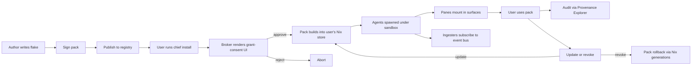

# Module System (L3)

## TL;DR

- Unit of extension: **Capability Pack** (a Nix flake).
- 7 extension axes: agents, tools, ingesters, panes, rituals, policies, plus the Stack (bundle).
- Pack installs declare capabilities up-front, user consents per kind, install is atomic and reversible.
- **Stacks** = forkable bundles of packs + house rules. The viral unit for power users ("dotfiles for your life").

## Extension axes

| Axis | Unit | Example | Author skill |
|---|---|---|---|
| Agent | `.harness()` / `.ai()` | tax-prep-agent | Engineer |
| Tool | Typed API wrapper | plaid-tool, stripe-tool | Engineer |
| Ingester | Feed → memory graph | kindle-highlights | Mid-level |
| Pane | Card on a surface | crypto-portfolio | Designer/dev |
| Ritual | Multi-agent workflow | monday-weekly-review | Prompt engineer |
| Policy | Declarative rule | "never ship before 9am" | Anyone |
| Stack | Curated pack bundle | "Founder Stack" | Anyone |

## Pack schema

A Capability Pack is a Nix flake. Minimal shape:

```nix
{
  description = "Travel planner pack";

  inputs = {
    chief-sdk.url = "github:santoshkumarradha/ChiefOS?dir=sdk";
  };

  outputs = { self, chief-sdk, ... }: {
    packs.x86_64-linux.travel-planner = chief-sdk.mkPack {
      name = "travel-planner";
      version = "0.3.1";

      agents = [ ./agents/flight-hunter.py ./agents/hotel-scout.py ./agents/itinerary-synth.py ];
      tools  = [ ./tools/skyscanner.ts ./tools/google-maps.ts ];
      ingesters = [ ./ingesters/travel-email-filter.ts ];
      panes = [ ./panes/trips-card.tsx ./panes/upcoming-travel.tsx ];
      rituals = [ ./rituals/pre-trip-checklist.yaml ./rituals/post-trip-expenses.yaml ];
      policies = [ ./policies/never-book-over-X.yaml ./policies/domestic-only-default.yaml ];

      grants = {
        "gmail.read"       = { scope.labels = [ "travel*" ]; };
        "calendar.read"    = { scope.calendars = [ "trips" ]; };
        "calendar.create"  = { scope.calendars = [ "trips" ]; };
        "stripe.charge"    = { scope.max_amount_usd = 500; scope.card = "travel-card"; };
        "net.http"         = { scope.hosts = [ "api.skyscanner.com" "maps.googleapis.com" ]; };
      };

      signature = "ed25519:<public-key>";
    };
  };
}
```

## Pack lifecycle



Diagram also at [`diagrams/pack-lifecycle.mmd`](./diagrams/pack-lifecycle.mmd).

## Install flow (CLI)

```
$ chief install github:acme/travel-planner
chief: resolving flake... ok (travel-planner v0.3.1)
chief: verifying signature... ok (author: acme, trust score: 4.6/5, 1.2k installs)

This pack requests:
  [ ] gmail.read          (labels: travel*)
  [ ] calendar.read       (calendar: trips)
  [ ] calendar.create     (calendar: trips)
  [ ] stripe.charge       (max $500, card: travel-card)
  [ ] net.http            (hosts: api.skyscanner.com, maps.googleapis.com)

Press SPACE to approve each. Hold SPACE to approve all. ESC to cancel.
```

Every grant is revocable at any time from the governance pane.

## Registry tiers

| Tier | Discovery | Signature | Review | Caps defaults | Insurance |
|---|---|---|---|---|---|
| Official | Top of search results; "Chief verified" badge | Chief OS key | Internal + legal | Minimal-needed, narrow | v1+: backed |
| Verified community | Mid listings; "verified" badge | Author + ≥ N peer attestations | Peer | Declared, scored | No |
| Community | Full listings with trust score | Author | Community reports | Declared | No |
| Private | Install-by-URL only | User-local | N/A | Declared | N/A |

Registry URL: `packs.chief-os.com` (proposed). Discovery is keyword + category + social signal (installs, Stacks including it, star-like signal).

## Stacks

A Stack is a Nix flake composing packs + default house rules + Trust Ledger initialization.

```nix
{
  outputs = { self, ... }: {
    stacks.x86_64-linux."founder-stack" = chief-sdk.mkStack {
      name = "founder-stack";
      packs = [
        "github:chief-os/inbox-triage"
        "github:chief-os/calendar-negotiator"
        "github:chief-os/daily-brief"
        "github:chief-os/finance-watcher"
        "github:acme/stripe-ops"
        "github:acme/linear-sync"
      ];
      house_rules = ./rules/founder.yaml;
      ledger_init = {
        "email/triage" = 3;
        "calendar/move-meetings" = 2;
        "finance/under-100" = 1;
      };
    };
  };
}
```

Install: `chief stack install github:nathan/founder-stack`.

**Stacks are the viral unit.** Creators, founders, researchers publish their Stacks. Others fork and iterate. GitHub star-like distribution, Nix-flake-like reproducibility.

## Governance (user-facing)

A single L4 pane: **Packs & Stacks.** Rows:

| Pack | Grants | Used this week | Last update | Trust | Actions |
|---|---|---|---|---|---|
| travel-planner v0.3.1 | 5 | 12 calls, $240 spent | 2026-04-10 | 4.6 | Revoke / Update / Inspect |
| inbox-triage v1.2 | 3 | 241 calls | 2026-04-20 | 5.0 | Revoke / Update / Inspect |

Revoke is one tap → atomic Nix rollback. Inspect → full agent chain via Provenance Explorer.

## Pack development kit (SDK)

Ships as `chief-sdk` — a Nix flake + library bindings:

- TypeScript bindings for agents, tools, panes.
- Python bindings for agents and ingesters.
- YAML schemas for rituals and policies.
- `chief-sdk new <pack-name>` scaffolds an example.
- `chief-sdk test` runs the pack in an isolated dev sandbox.
- `chief-sdk sign --key <path>` signs before publish.

## Acceptance

- [ ] Pack flake schema stable and versioned; breaking changes require ADR.
- [ ] Install UI shows every cap kind explicitly; no silent grants.
- [ ] Revoke triggers Nix rollback atomically within 5 seconds.
- [ ] Signature verification is mandatory; unsigned packs rejected.
- [ ] Pack dev kit can scaffold, test, and sign an example in < 60 seconds.

## Open questions

1. Should Stacks allow pack-version overrides, or always take the Stack author's pinned versions?
2. How do we handle pack → pack dependencies (Stack-internal overlaps)?
3. Is there a read-only "trial" mode for packs (all actions stubbed) to let users try before granting?
4. Do ingesters run continuously or on event-bus triggers? Bias: event-bus triggers for efficiency.
5. Can packs register new capability *kinds* (extending the Broker's enum) or only consume known ones? Bias: closed enum in v0.

## Related

- [`architecture`](./10-architecture.md) — L3 placement
- [`security-model`](./14-security-model.md) — signing, sandboxing, supply chain
- [`chief-kernel`](./11-chief-kernel.md) — Capability Broker consumes pack grants
- [`oss-business`](./61-open-source-business.md) — licensing & registry economics
- [`viral-loop`](./60-viral-loop.md) — Stacks as the forkable viral unit
