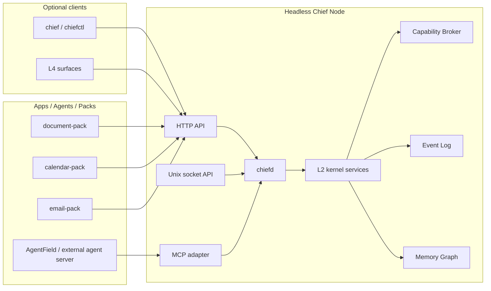

# Headless Chief Node

## TL;DR

- Chief OS is first a protocol and kernel substrate, not a desktop UI.
- The first product mode is a headless Chief Node: `chiefd` + `chief`/future `chiefctl` + HTTP/local-socket APIs + packs.
- Chief OS is not the semantic orchestrator; packs, apps, and external agent servers own planning and domain workflow.
- UI surfaces are optional clients over the same state; they are not allowed to own workflow logic.
- This is a working product definition and will keep evolving as the vision sharpens.

## Context

The phrase "iOS for agents" is useful because it explains why agents need an OS-level contract instead of another app or framework. It can also over-pull the roadmap toward visual surfaces too early.

The more precise v0 product definition is:

> Chief OS is an agent-native operating substrate. Apps and agents run on top of a shared kernel that owns work state, capabilities, provenance, authority, and human approval.

The visual OS should come later. The immediate proof should work in a server/headless setting, where agents and packs interact with Chief through stable protocol channels.

## Linux analogy

Linux made server software reliable by giving programs a common substrate:

| Linux-era concept | What it gave server software | Chief OS analogue for agentic work |
|---|---|---|
| Process | A supervised unit of execution | Agent / harness session |
| User / group | Identity and isolation boundary | Kernel-issued principal |
| File descriptor | Scoped access to a resource | Capability handle |
| Filesystem | Durable shared state | Memory Graph + Chief FS |
| Socket | Programmatic communication channel | HTTP, local socket, MCP adapter |
| Package manager | Installable software units | Signed packs |
| `systemd` service | Long-running managed daemon | Pack worker / agent runtime task |
| `sudo` / polkit | Explicit authority escalation | Ceremony / Broker approval |
| `auditd` / logs | Replayable operational record | Provenance / Event Log |

Chief OS should play the same role for agents that Linux plays for services: the boring, durable substrate underneath many independently authored programs. The difference is that agentic work needs new first-class objects: work state, memory, model calls, tool authority, human approval, and rewind.

## Substrate, not orchestrator

Chief OS should not decide the semantic plan for a user's work. It should not choose the agent graph, decide the business workflow, or replace orchestration frameworks. That belongs above the OS boundary.

| Chief OS owns | Apps / packs / agent servers own |
|---|---|
| Principal identity | Domain-specific planning |
| Capability checks | Agent selection |
| Runtime isolation and lifecycle | Task decomposition |
| Shared Work Object state | Business workflow |
| Model/tool mediation | Prompting and reasoning strategy |
| Provenance and receipts | Domain-specific correctness |
| Ceremony and approval gates | When to request an action |
| Rewind mechanics | How to recompute after rewind |

Linux has CPU schedulers, process supervisors, sockets, files, users, permissions, logs, and package installation. It does not decide whether an application should be a web server, database, CI runner, or workflow engine. Chief should take the same posture: it can mechanically coordinate resources, events, authority, and state, but semantic orchestration lives in user-space programs.

```text
Human / CLI / API / Surface
          |
          v
+------------------------------------------+
|                Chief OS                  |
| identity | capabilities | memory         |
| runtime  | event log    | approval       |
| rewind   | HTTP/socket  | pack install   |
+--------------------+---------------------+
                     |
                     v
+------------------------------------------+
| Apps / Packs / Agent Servers             |
| simple script                            |
| event handler                            |
| AgentField app                           |
| LangGraph / CrewAI / AutoGen app         |
| custom orchestrator                      |
| first-party Chief-of-Staff pack stack    |
+------------------------------------------+
```

Users do not always need to bring an explicit orchestrator. A simple pack can be a script or event handler. A complex app can embed AgentField, LangGraph, CrewAI, AutoGen, or a custom orchestrator. Chief treats all of them as user-space applications that request capabilities, read/write Work Objects, and emit receipts.

## Usage model

People do not primarily "use" a headless Chief Node by opening an app. They run it as the place where agentic work happens.

| Actor | How they use Chief |
|---|---|
| Human owner | Creates or steers Work Objects, approves high-stakes actions, inspects provenance, rewinds bad contributions. |
| Agent / pack | Reads scoped work state, requests capabilities, writes contributions, emits signed receipts. |
| Developer | Builds packs against `chief-sdk` instead of rebuilding auth, memory, approval, audit, and tool policy per app. |
| Operator | Runs nodes, connects tools, manages pack install, observes health, exports logs. |
| External agent server | Treats Chief as a local/remote capability and memory server through protocol APIs. Examples: AgentField, LangGraph, CrewAI, AutoGen, or a custom service. |

The key product behavior is that users manage durable work, not individual agent sessions. A Work Object is the thing they return to throughout the day; agents, packs, surfaces, and approvals are participants around it.

## Product / technical split

These names describe product roles. They should not create new primitives by themselves.

| Product concept | User-perspective meaning | Technical substrate |
|---|---|---|
| Chief Node | The headless OS runtime where agentic work lives | `chiefd`/`chief-core`, L2 services, pack runtime, state directory |
| Chief Control | Ways humans inspect and steer the node | CLI, HTTP clients, Work Object View, Inbox, Ceremony, Provenance/Rewind views |
| Chief Pack | An app installed on Chief | Signed package, manifest, SDK implementation, scoped grants |
| Work Object | One durable unit of cross-app work | `mem://artifact/...` aggregate projected by `/v1/work/:id` |
| Permission | What an actor may read, write, or do | Capability grant checked by the Broker |
| Approval | Human authorization for consequential action | Ceremony token bound to exact payload hash |
| Receipt | Evidence of what happened | Provenance/Event Log entry |
| Rewind | Remove active effect while preserving history | Tombstone/stale markers plus replayable provenance |
| Inbox item | Something that needs attention | Typed kernel event projected through surfaces |

The product boundary is: Chief owns the substrate; packs own domain behavior; surfaces own human legibility.

## Contract

| Component | Contract |
|---|---|
| `chiefd` | Long-running daemon that owns L2 kernel services, pack execution, Memory Graph, Broker, Event Log, Ceremony queue, and Work Object projections. |
| `chief` / future `chiefctl` | CLI control plane for humans and automation. Anything visible in UI must be inspectable here. |
| HTTP API | Remote and local protocol surface for Work Objects, inbox, packs, provenance, rewind, and approvals. |
| Local socket API | Same semantic contract as HTTP for local agents and low-latency host integrations. v0 may lag here, but every exception needs a tracked follow-up. |
| MCP / agent-server API | Future compatibility layer for agent runtimes such as AgentField, LangGraph, CrewAI, AutoGen, or custom services that want to treat Chief as their tool/capability server. This must wrap existing Broker/Memory/Event primitives, not bypass them. |
| L4 surfaces | Optional reference/control clients. They render L2 state and submit user intent back through the kernel. |

External app minimum loop:

```text
GET  /v1/work/:id
POST /v1/work/:id/contributions
GET  /v1/work/:id/provenance
```

`POST /v1/work/:id/contributions` is the first public app write path for the POC ladder. It writes an existing `finding`, `artifact`, or `decision` node with `body.work_object_id = :id`, checks Broker `mem.write`, and attributes the contribution to `x-chief-principal`. This is a developer-facing protocol affordance over Memory Graph, Broker, and Provenance; it is not a new kernel primitive.

Invariants:

- No surface owns authority, memory, or workflow state.
- No pack calls another pack directly for coordination.
- No Chief kernel service owns semantic orchestration or domain planning.
- No new storage namespace is introduced for "work"; Work Objects remain projections over `mem://artifact/...`.
- New developer-facing protocol affordances must map to existing kernel primitives or get an ADR.

## Decisions

1. **Headless node is the first product mode.**

   Rationale: the strongest proof is not that Chief has a beautiful UI. It is that independent apps and agents can coordinate through an OS-owned substrate without pairwise integrations.

2. **UI is a reference/control surface over the node.**

   Rationale: humans still need oversight, approval, and rewind. But those interactions should prove channel parity, not create a second source of truth.

3. **The first demo should make protocol access obvious.**

   Rationale: `curl /v1/work/acme-follow-up` and `chief work show acme-follow-up --json` are not developer conveniences. They show that Chief is an operating substrate agents can address directly.

4. **MCP/socket work should come before deep UI polish.**

   Rationale: if Chief is "modern Linux for agent servers," then agents need a local, headless, low-friction way to discover work state, request capabilities, and submit contributions.

5. **Product vocabulary must stay user-facing but primitive-faithful.**

   Rationale: names like Chief Node, Chief Control, and Work Object help humans understand the product. They must remain mappings onto the existing architecture unless an ADR introduces a new primitive.

6. **Orchestration is user-space.**

   Rationale: Chief exists to make agent apps safe, stateful, inspectable, and governable. It should support AgentField, LangGraph, CrewAI, AutoGen, custom orchestrators, and simple scripts without making any of them the kernel's planning model.

## Diagram



## Acceptance

- [ ] `chiefd` can run without any UI process.
- [ ] Work Objects are readable through HTTP and CLI in every demo.
- [ ] Local socket parity is either implemented or explicitly tracked as a narrow exception.
- [ ] Pack install, contribution, Ceremony queue, provenance, and rewind work without a visual client.
- [ ] Any UI demo can be replayed through CLI/API calls over the same state.
- [ ] A simple pack works without an orchestrator, and an external AgentField/custom agent server can use the same protocol boundary.
- [ ] Public docs describe usage and architecture without pricing, monetization, or commercial packaging language.

## Open questions

1. Should `chiefd` and the current `chief-core` binary converge, or should `chiefd` be a packaging name over the same binary?
2. Is MCP a v0 requirement or a v1 compatibility adapter once HTTP/CLI parity is stable?
3. What is the minimum local-socket contract needed for agent servers before desktop surfaces get more polish?

## Related

- [`architecture`](./10-architecture.md) — L0-L4 layers
- [`chief-kernel`](./11-chief-kernel.md) — L2 service contracts
- [`pack-sdk`](./40-pack-sdk.md) — developer contract for packs
- [`chief-app-protocol`](./42-chief-app-protocol.md) — public protocol loop for external apps
- [`surfaces`](./30-surfaces.md) — optional L4 projections
- [`v0-scope`](./50-v0-scope-90-day.md) — MVP scope and gates
